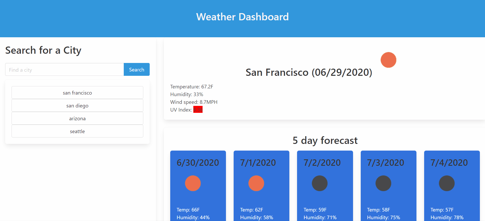

# Weather Forecast

## About the project

This application allow users to search for the current and five days weather forecast for their selected city. 

---

## Getting started
Below are the prerequisite understanding and programs that were utilized :
* Visual Studio Code-click [here](https://code.visualstudio.com/) to a tutorial to install
* Github repository-click [here](https://help.github.com/en/github/)
* Bulma-click [here](https://bulma.io/documentation/)

* jQuery-click [here](https://code.jquery.com/jquery-3.4.1.min.js)

* aJax- click [here](https://cdnjs.cloudflare.com/ajax/libs/moment.js/2.24.0/moment.min.js)
---

## Code spotlight

The code snippet below store the user's input into local storage upon clicking save for later retrieval.
```js
{
    $("#saveBtn10").on("click", function(event){
    event.preventDefault();
    var userInput = $("#user-input-10").val()
    console.log(userInput)
    localStorage.setItem("user-input-10", JSON.stringify(userInput));
});

}
```
## Demo



---

## Deployed link

[Live site](https://mtbanh.github.io/05-day-planner/)
---

## Author

**Mai Banh**
- [Link to Github](https://github.com/mtbanh)
- [Link to LinkedIn](https://www.linkedin.com/in/mai-banh-311ba6164/)

See also the list of [contributors](https://github.com/your/project/contributors) who participated in this project.

## Acknowledgments
Thank you to Joel, Isaias, Colin, and Ayla for helping out! 